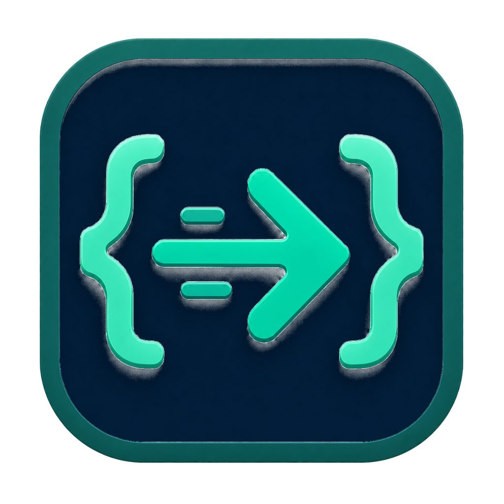

<p align="center">
  
</p>

<h1 align="center">CurlPyPro</h1>

<p align="center">
  A fast, lightweight, offline-first API client for the desktop, built with Python and PyQt6.
  <br>
  No account, no cloud sync, no telemetry. Your requests stay on your machine.
</p>

<p align="center">
  <a href="https://github.com/lewisMachilika/CurlPyPro/actions/workflows/build.yml"></a>
  <a href="https://github.com/lewisMachilika/CurlPyPro/releases/latest"></a>
  <a href="LICENSE"></a>
  
  
</p>

<!-- Add a screenshot: save it as docs/screenshot.png and uncomment the line below. -->
<!-- <p align="center"></p> -->

---

## Why CurlPyPro?

Postman-style tools keep getting heavier and increasingly want you signed in.
CurlPyPro is a single native app that opens instantly, works fully offline, and
keeps everything in one local SQLite file you control.

## Features

### Build requests

- Any HTTP method, multiple request tabs
- Query-parameter table with enable/disable per row (auto-extracted from the URL)
- Headers, raw/JSON body, and `multipart/form-data` file and image uploads
- **GraphQL** body mode with a variables editor and a schema browser that
  builds queries from introspection
- Paste a `curl` command into the URL bar to import it

### Auth

- Bearer token, Basic auth, API key (header or query)
- OAuth 2.0 (client credentials, password, authorization code)

### Environments

- `{{VAR}}` substitution in URL, params, headers, auth and body
- Switch between environments (dev / staging / prod) in one click
- **Request chaining:** capture a value from a response (JSON path, header,
  status or regex) into a variable that later requests use, e.g. log in once
  and reuse `{{TOKEN}}` everywhere
- **Secrets in the OS keychain:** mark a variable as secret and its value is
  stored in Windows Credential Manager, macOS Keychain or Secret Service
  instead of the local database

### Inspect responses

- Status, timing, size, and headers
- Pretty-printed JSON, HTML and XML; image and HTML previews
- **Diff** each response against the previous one (or any history entry),
  ignoring JSON key order
- Save raw responses, extract base64 payloads, export HAR files

### Transport control

- Redirects, SSL verification, timeouts, and automatic retries
- Proxy support, including the Windows system proxy and PAC setups
- Cookie jar viewer and editor

### Test and automate

- **Assertions** on status, response time, headers, body size, body text and
  JSON paths (`$.data.items[0].id`, `$.items.length`), with quick-add presets
- **Collection runner:** run a whole collection in order with iterations,
  delays and stop-on-failure; export results as JSON or **JUnit XML** for CI
- Post-response Python scripts that can read the response and update variables

### Import

- **Postman** collections (v2.0 / v2.1) and environments, including folders,
  auth inheritance, path variables and simple status tests
- **OpenAPI 3** and **Swagger 2** specs in JSON or YAML: every operation becomes
  a request with example bodies, query params and auth, plus a `{{baseUrl}}`
  environment

### Realtime

- **WebSocket** console: connect, send and receive messages with pretty-printed JSON
- **Server-Sent Events** viewer that parses event names, ids and data

### Productivity

- History and saved collections
- Code snippets for curl, Python `requests`, PowerShell, Java, and axios
- Stress testing with concurrency, status breakdowns and latency summaries
- Light and dark themes

## Install

### Download (recommended)

Grab the latest build for your OS from the
[Releases page](https://github.com/lewisMachilika/CurlPyPro/releases/latest):

| OS      | File                                                          |
|---------|---------------------------------------------------------------|
| Windows | `CurlPyPro-Setup.exe` (installer) or `CurlPyPro.exe` (portable) |
| macOS   | `CurlPyPro` (see note on Gatekeeper below)                    |
| Linux   | `CurlPyPro`, then `chmod +x CurlPyPro`                        |

> Binaries are not code-signed yet, so Windows SmartScreen or macOS Gatekeeper
> may warn on first launch. On Windows choose **More info → Run anyway**; on
> macOS right-click the app and choose **Open**.

### Run from source

Requires Python 3.10 or newer.

```bash
git clone https://github.com/lewisMachilika/CurlPyPro.git
cd CurlPyPro
python -m venv .venv
# Windows: .venv\Scripts\activate    macOS/Linux: source .venv/bin/activate
pip install -r requirements.txt
python curlpypro.py
```

## Keyboard shortcuts

| Shortcut       | Action                |
|----------------|-----------------------|
| `Ctrl+T`       | New request tab       |
| `Ctrl+W`       | Close current tab     |
| `Delete`       | Delete selected history entry |
| `Ctrl+Shift+C` | Copy current snippet (in the snippet dialog) |
| `Ctrl+Enter`   | Send message (in the WebSocket console) |

## Where is my data?

Everything lives in `~/.curlpypro/curlpypro.db` (SQLite): history, collections,
environments, cookies and settings. Back up or copy that file to move your
workspace to another machine.

Environment variables marked **Secret** are the exception: their values live in
your OS keychain under the service name `CurlPyPro`, so they don't travel with
the database file. Everything else, including auth fields typed directly into a
request and stored history, is saved **unencrypted**. See [SECURITY.md](SECURITY.md).

## Build a standalone app

CurlPyPro packages into a single self-contained executable with
[PyInstaller](https://pyinstaller.org). Each OS must be built on that OS;
PyInstaller cannot cross-compile.

- **Windows:** `./scripts/build.ps1` produces `dist/CurlPyPro.exe`, plus
  `dist/installer/CurlPyPro-Setup.exe` when [Inno Setup 6](https://jrsoftware.org/isinfo.php)
  is installed. The installer adds a Start Menu entry and an optional desktop shortcut.
- **macOS:** `./scripts/build.sh` produces `dist/CurlPyPro.app`.
- **Linux:** `./scripts/build.sh` produces `dist/CurlPyPro`.

Or manually:

```bash
pip install -r requirements-dev.txt
pyinstaller curlpypro.spec --noconfirm
```

### Releases via CI

[`.github/workflows/build.yml`](.github/workflows/build.yml) builds Windows,
macOS and Linux binaries on every push and pull request. Pushing a version tag
attaches all three to a GitHub Release:

```bash
git tag v1.0.0
git push origin v1.0.0
```

## Roadmap

Ideas being considered. Upvote or discuss them in
[Issues](https://github.com/lewisMachilika/CurlPyPro/issues):

- [x] Response tests and assertions with a collection runner
- [x] Import Postman collections and OpenAPI/Swagger specs
- [x] GraphQL body mode with schema introspection
- [x] WebSocket and Server-Sent Events support
- [x] Response diff between two runs
- [x] Chain requests by capturing response values into variables
- [x] Secrets in the OS keychain
- [ ] Command-line runner for CI pipelines
- [ ] Export collections back to Postman format
- [ ] Automated test suite and linting in CI

## Contributing

Contributions are welcome! Read [CONTRIBUTING.md](CONTRIBUTING.md) to get
started, and please follow the [Code of Conduct](CODE_OF_CONDUCT.md).
Found a security issue? See [SECURITY.md](SECURITY.md).

## License

[MIT](LICENSE) © Lewis Machilika and CurlPyPro contributors
